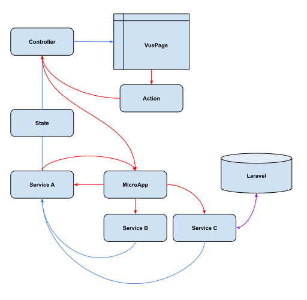

# Application Overview

This Client-side Vue Application is built using LaravelMicro.js to facilitate 
auto-loaded, dependency injected, javascript objects. View the LaravelMicro.js 
documentation to understand the base libraries this code is extending.

### LaravelMicro.js Framework Docs
> https://bayareawebpro.github.io/laravel-micro.js

